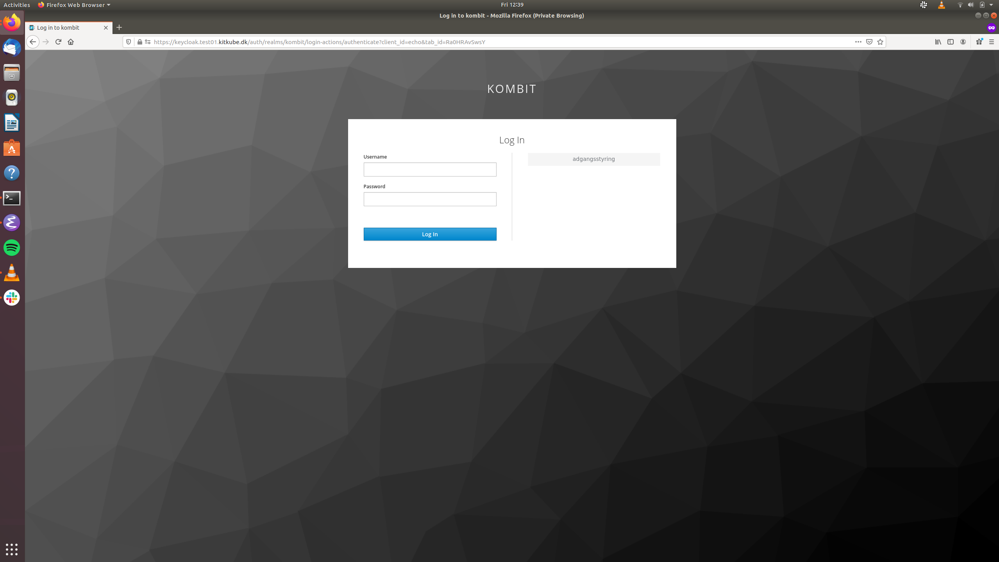
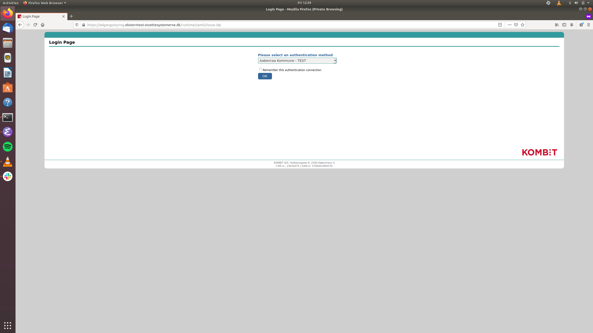
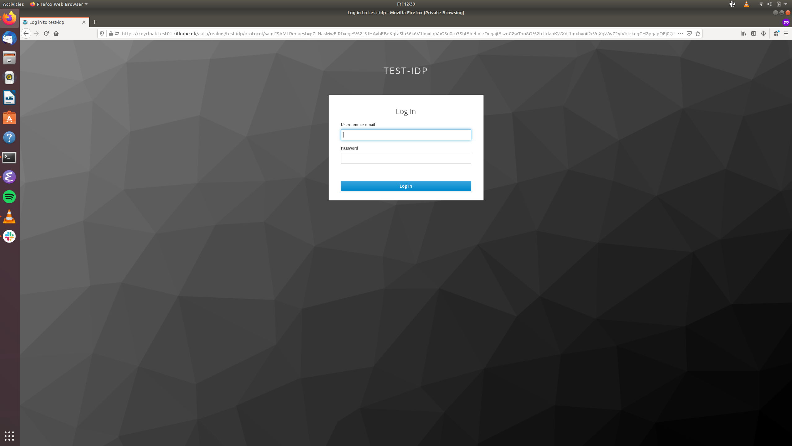
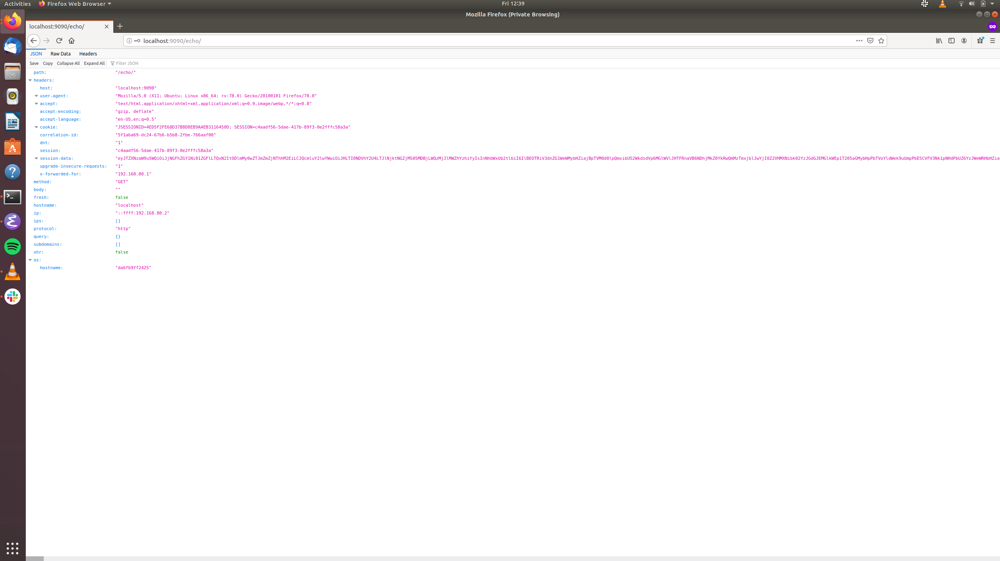

# Login gennem KOMBIT Adgangsstyring
Denne vejledning beskriver hvordan man som tjenesteudbyder opsætter sin applikation, så den tilbyder login gennem KOMBIT Adgangsstyring. Login går gennem KIT's infrastruktur, og man får således mulighed for at logge ind gennem Adgangsstyring, uden at man skal oprettes som tjenesteudbyder i KOMBITs infrastruktur. Man kan desuden teste login gennem KIT's test-idp, så man ikke behøver at involvere en kommune før senere i forløbet.

KOMBIT Adgangsstyring er en fælleskommunal løsning, der fungerer som bindeled mellem kommunale brugerdatabaser (AD og lignende produkter) og brugervendte systemer, så det brugervendte system kun skal håndtere login gennem Adgangsstyring.

Vejledningen beskriver hvilke skridt man skal udføre for at gennemføre opkoblingen. Der medfølger også et demo-setup, der demonstrerer login.

## Forudsætninger
For at køre setuppet har man brug for at have [Docker Community Edition](https://docs.docker.com/install/) installeret. 

For at etablere login gennem sin applikation, skal applikationen kunne kommunikere over SAML 2.0-protokollen. Det er op til tjenesteudbyderen at vælge, hvordan dette skal gøres. Man kan enten importere et SAML-rammeværk i sin applikation, eller deploye sin applikation bag en SAML-proxy (demo-setuppet fungerer på denne måde). Dette vil uanset hvad medføre, at man skal generere et nøglepar for sin applikation. Til testformål kan der anvendes selvsignerede certiifikater, mens der til produktion skal anvendes CA-udstedte certifikater.

## Det udleverede setup
Setuppet består af en række containere, beskrevet i filen testlogin/docker-compose.yml, samt en række filer, som vist her:

```
.
├── docker-compose.yml
└── echo
    ├── certificates
    │   ├── echo.cert
    │   └── echo.pem
    └── config.json

```

Demo-applikationen, som er beskyttet af login, er en simpel applikation som blot skriver de requests den modtager tilbage til klienten.

Man starter setuppet ved at køre:

```
docker-compose up
```

Når containerne er oppe tilgår man _http://localhost/_ i en browser. Man viderestilles til KeyCloak, og klikker på 'adgangsstyring':



Man får nu vist en oversigt over login-muligheder:.



I produktion er det kun kommuner, der har lov til at fremgå af listen. I test kan leverandører opsætte test-IdP'er. Vælg 'KIT Test IdP', og klik ok. Man videresendes nu til KIT's keycloak-server:



Her kan man logge ind med følgende test-credentials: 'test'/'Test1234'. Klik 'ok'. Man videresendes nu til demo-applikationen, og login er udført:



Hvis man får vist ovenstående skærmbillede, så har man succesfuldt fået setuppet til at køre.

## Opkobling til Keycloak
For at etablere opkobling til Keycloak, skal der udveksles metadata mellem applikationen og Keycloak. Dette beskrives i de følgende afsnit.

### Generere metadata for applikation
Applikationen skal oprettes i Keycloak, og til dette formål skal der genereres metadata for applikationen. Hvordan dette gøres afhænger af applikationens valgte saml-rammeværk, men kan typisk genereres ved at tilgå en bestemt url, som applikationen udstiller ved hjælp af rammeværket. Når metadata er genereret, sendes det til KIT (njo@kvalitetsit.dk eller mads@kvalitetsit.dk).

### Hente metadata fra Keycloak
Applikationen skal sættes op til at genkende Keycloak som identity provider, hvilket gøres ved at installere en metadata-fil for Keycloak i applikationen. Man henter metadata for Keycloak her: https://keycloak.test01.kitkube.dk/auth/realms/kombit/protocol/saml/descriptor. Metadata-filen skal placeres et sted hvor applikationen kan læse den, hvilket igen afhænger af det valgte saml-rammeværk.

### Test af login
Login kan nu testes ved at følge proceduren beskrevet tidligere.

## Attributter
[work in progress] Som udgangspunkt får man kun udleveret et meget begrænset sæt standard-attributter. Det er muligt at lave opslag i den fælleskommunale infrastruktur, men dette er foreløbigt under udvikling.

## Roller
[work in progress] Det er muligt at mappe roller ud, hvis der er behov for det.

